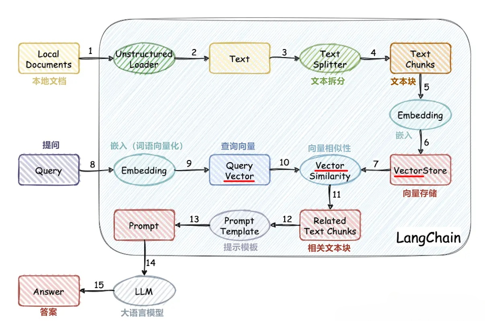

<!-- 
大型语言模型 (LLM) 本身具有广泛的知识，但这些知识是静态的（训练到某个时间点为止），并且不包含私有或特定领域的信息。为了让 LLM 能够基于特定文档或知识库回答问题，我们可以使用 **检索增强生成 (Retrieval-Augmented Generation, RAG)** 的方法。

其中一个关键部分是创建一个 **向量存储库 (Vector Store)**。这个存储库会将你的知识库文档转换成数字表示（向量嵌入），并能根据用户问题的相似性快速检索相关文档片段。

为了完成对知识库中内容的理解，我们要完成下面几个步骤：

0.  准备工作：本地文档(包括pdf、txt、excel、数据库等)清洗、加载、提取。
1.  将提取出的文本拆分成文本块的形式。
2.  使用 **嵌入模型(embeddings)** 将文本块转换为高维向量。
3.  将文本块及其向量存储在向量存储库中。
4.  对于要查询的文本也利用embeddings进行向量化，并通过向量存储库进行相似性查询，检索向量存储库里已经存储的相关文本块。
5.  llm结合prompt模板进行输出。
   

常用向量存储库的比较

Chroma:优点：操作简单，开源免费，支持内存存储(临时)和本地磁盘存储
Qdrant:优点：开源免费，支持内存存储(临时)、本地磁盘存储、云端存储(4G额度)、docker存储
pinecone：优点：支持云端存储 -->

# 🔍 利用向量存储实现知识库增强的语言模型问答（RAG 原理简要教程）

大型语言模型（LLM）具备强大的语言理解和生成能力，且拥有广泛的常识知识。然而，这些知识存在两个核心局限：

1. **静态性**：训练数据只覆盖某一时间点之前的内容，无法反映后续知识演进。
2. **泛化性**：LLM 并不掌握企业内部文档、个人笔记或专业领域资料等特定知识。

为了解决这些问题，我们可以使用 **检索增强生成（Retrieval-Augmented Generation, RAG）** 技术，让 LLM 在回答问题前，先从“知识库”中检索相关内容，再结合提示（Prompt）进行智能生成。

---

## 📦 RAG 知识库构建流程
为了让 LLM 真正“读懂”知识库中的内容，我们需完成以下步骤：

### 0️⃣ 准备阶段：文档收集与清洗
- 支持的文件类型包括 `.txt`, `.pdf`, `.docx`, `.xlsx`, `.md`, 数据库内容等。
- 提取纯文本内容，去除无关字符，进行格式统一处理。

### 1️⃣ 文本切分（Chunking）
- 长文档需要拆分成小段文本块（chunk），通常每块长度为 100~500 字符，可加一定重叠（overlap）提升上下文连贯性。
- 例如：`chunk_size=300, overlap=50`

### 2️⃣ 文本向量化（Embeddings）
- 使用中文或多语种嵌入模型，如：
  - `shibing624/text2vec-base-chinese`
  - `sentence-transformers/paraphrase-multilingual-MiniLM-L12-v2`
- 每个文本块将被转换为一个高维向量（通常为 384 ~ 768 维）

### 3️⃣ 向量存储（Vector Store）
- 将文本块及其对应向量保存到一个向量数据库，便于快速相似度搜索。
- 向量存储库支持：
  - 添加（add）
  - 删除（delete）
  - 相似度搜索（similarity search）

### 4️⃣ 查询阶段
- 用户输入问题 -> 转换为向量 -> 在向量库中进行最近邻搜索（top-k）
- 返回相关的文本块内容供 LLM 生成回答

### 5️⃣ 响应生成
- 将用户问题 + 检索到的文本内容 + Prompt 模板，一并输入 LLM
- 生成准确且基于知识库的答案

---

## 💡 常用向量存储工具比较

| 向量库 | 优点 | 支持存储类型 | 是否开源 |
|--------|------|----------------|-----------|
| **Chroma** | 简洁易用，快速集成 | 内存存储、本地磁盘 | ✅ 是 |
| **Qdrant** | 支持向量+payload，灵活部署 | 内存、本地、云端（最多4G） | ✅ 是 |
| **FAISS** | Facebook开源，检索速度快 | 本地内存 | ✅ 是 |
| **Pinecone** | 高可用云服务，易扩展 | 云端托管 | ❌ 否（闭源） |

---

## 📌 小结

文档中的文件是基于langchain+向量存储库实现的,包括chroma,qdrant,pinecone;使用pinecone需要提前进入[官网](https://www.pinecone.io/)注册。

另外，[langchain文档](https://python.langchain.com/docs/integrations/vectorstores/)中也给出了其他可与langchain兼容使用的向量存储库。

<!-- RAG 框架的核心是“检索 + 生成”：

- LLM 不负责记住全部内容，而是负责**理解上下文 + 生成语言**。
- 向量存储负责快速定位**与问题最相关的文档片段**。
- 通过嵌入模型和向量搜索，可以让 LLM 融合**私有知识、专业资料、实时信息**，实现定制化智能问答。

本地部署或轻量级原型可以优先使用 Chroma / FAISS / Qdrant。

商业部署可考虑 Pinecone 等云服务，结合身份验证、安全隔离等功能。

--- --> 
